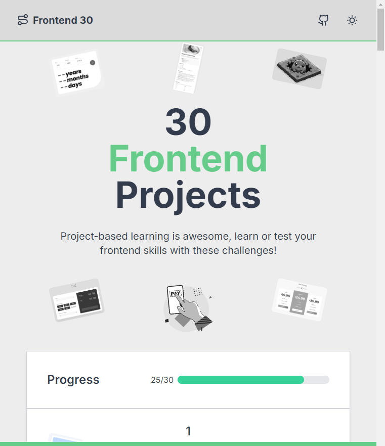

# Frontend 30 Projects

## Visit

https://frontend-30.vercel.app/

## Description

This project presents a roadmap featuring 30 challenges designed to enhance your skills in web development. The challenges focus on **React**, **Tailwind**, and **TypeScript**. Whether you're a beginner or looking to refine your existing knowledge, this roadmap allows you to tackle challenges in any order, making it a flexible learning tool.

## Usage

Each challenge in this roadmap is designed to be completed independently. You can start from the first challenge or select any challenge that interests you. The challenges cover various aspects of **React**, **Tailwind**, and **TypeScript**.

To get started, follow the instructions provided in each challenge folder.

## Contributing

We welcome contributions from the community! 

## Acknowledgments

- Built by various free online learning resources.

## Give a Star 🌟

If you find this project helpful, click the star to show your support!
